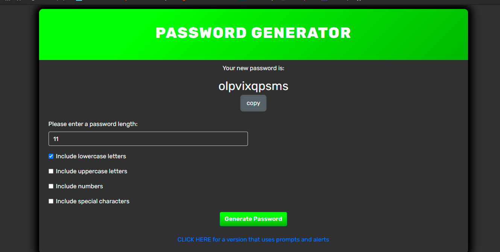
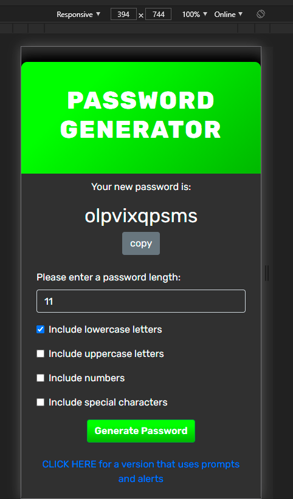

# homework_wk3_passwordgen
wk3 homework to create a password generator using javascript

## function/ features
The user selects a password length and the types of characters they would like to include.\
If the selected length is less than 8 or greater than 128, or the don't select at least one character type a warning will be displayed and a password will not be generated.\
The password can also be copied to the users clipboard.

## how the password is generated
I created a series of functions that generate a character of a certain type based on its ascii character.\
I then randomised which function to run and checked that relevant type was selected by the user.\
This was repeated until the password was the desired length.\
If the password did not contain any of the types selected by the user the function would run again until a password with all the selected types is generated.

[checkout the final site](https://nick75mowbray.github.io/homework_wk3_passwordgen/)
